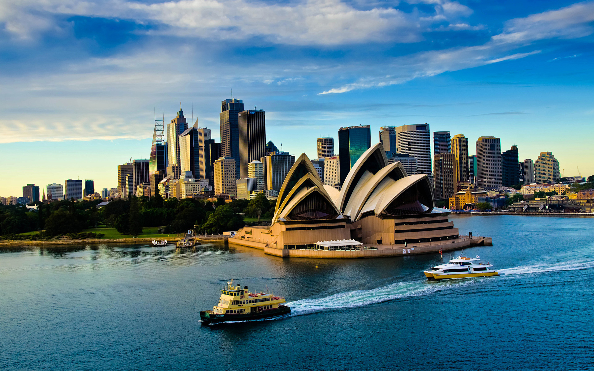
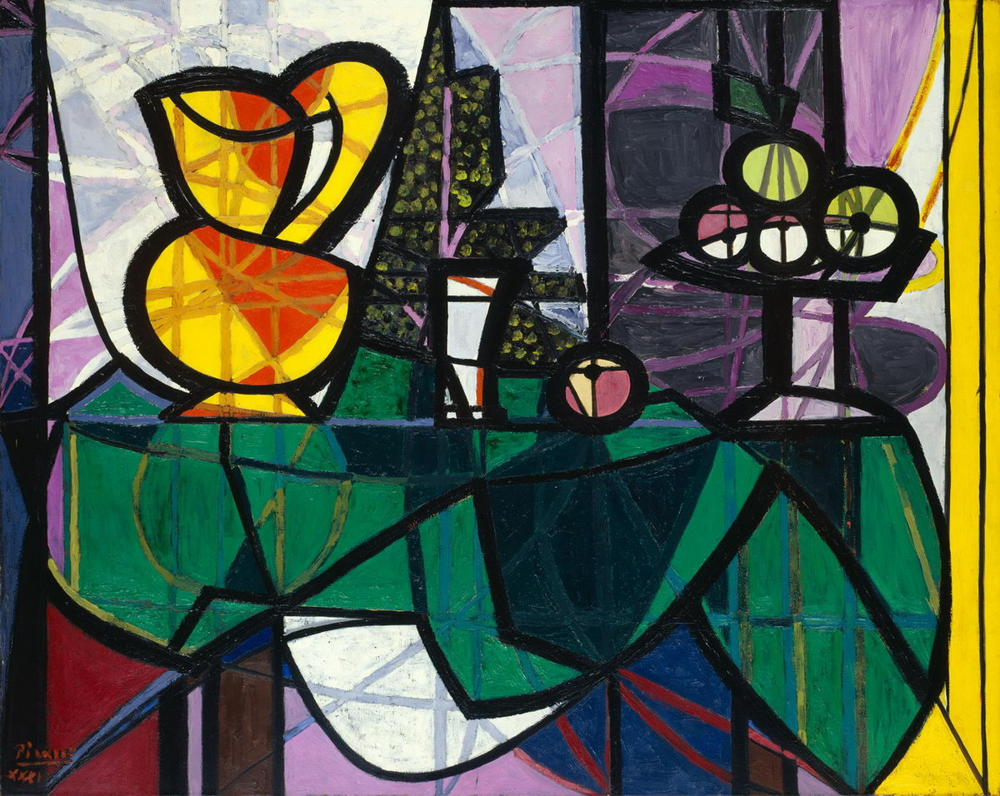
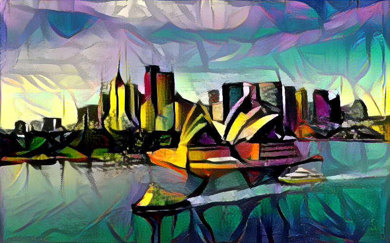

# Neural Style Transfer

This is a Keras implementation of [A Neural Algorithm of Artistic Style](https://arxiv.org/abs/1508.06576) by Leon A. Gatys, Alexander S. Ecker and Matthias Bethge.

### Content image - Sydney Opera House


### Style image - Still Life Painting By Pablo Picasso


### Transfer demo


### Output image



## Implementation
  basic usage:
  ```
  python styletransfer.py images/003sydney.jpg images/style_picasso.jpg result_sydney_picasso
  ```

  options:
  - content_weight
  - style_weight
  - iter

  ```
  python styletransfer.py --content_weight 0.015 --iter 1 images/003sydney.jpg images/style_picasso.jpg result_sydney_picasso
  ```


## Dependencies
- Python 3.x
- Keras
- Tensorflow

## Reference
This implementation uses some code from Francois Chollet's [Neural Style Transfer](https://github.com/fchollet/keras/blob/master/examples/neural_style_transfer.py).

This paper presents an algrithm for generating a mixed image with the content from the content image and the style from another image, using the convolutional neural network(CNN).

